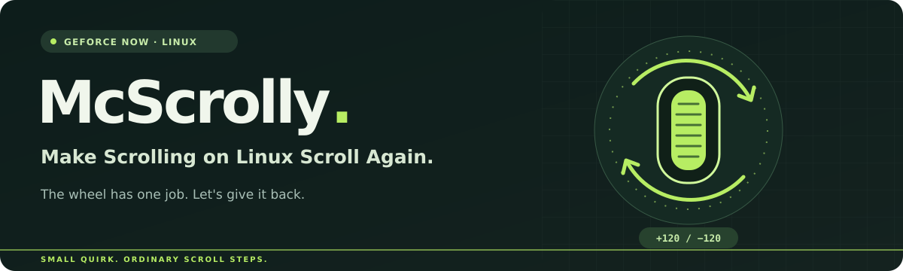

<p align="center">
  
</p>

# McScrolly

Make Scrolling on Linux Scroll Again.

A tested Logitech G903 scroll-wheel workaround for NVIDIA GeForce NOW's native Linux app on Wayland.

Your games are in the cloud. Your scroll wheel shouldn't be.

If the wheel spins enthusiastically while GeForce NOW treats it as a decorative feature, this repository documents the small input configuration change that fixed our setup. The wheel has one job. We would like it back.

[Confirmed hardware](#confirmed-working-hardware) · [Get scrolling](#get-scrolling) · [How it works](docs/how-it-works.md) · [Troubleshooting](docs/troubleshooting.md) · [Report a result](https://github.com/atk0309/McScrolly/issues/new?template=compatibility-report.yml)

## Confirmed working hardware

The wheels with receipts. These setups have been reported working with the native NVIDIA GeForce NOW Linux app. Each result applies to the listed setup and connection; check its evidence for versions and test limits.

| Mouse | Connection | Tested desktop | GeForce NOW result | Evidence |
| --- | --- | --- | --- | --- |
| Logitech G903 LIGHTSPEED (HERO sensor) | Wireless receiver | Ubuntu 24.04.4, GNOME Wayland | Owner confirmed working | [Original test](#tested-with-receipts) |

One confirmed setup so far. The original confirmation did not record the exact game or wheel action. Wired mode, sleep/wake and receiver reconnect behaviour remain untested.

[Report your setup](https://github.com/atk0309/McScrolly/issues/new?template=compatibility-report.yml) to help grow the table. Test scrolling inside a streamed game and include the result; new reports are reviewed before being added.

## The wheel deal

Keep high-resolution mode enabled on the mouse, then tell libinput to use the ordinary wheel steps the Linux driver already generates. This keeps the hardware and driver in agreement while giving applications whole scroll steps.

| Layer | Setting |
| --- | --- |
| Mouse, through Solaar | Scroll Wheel Resolution: on |
| libinput, for this G903 | Ignore the high-resolution wheel event codes |
| Applications | Receive ordinary wheel steps |

Yes, the Solaar switch stays on. The filtering happens further along the input path. Turning only the hardware setting off can leave it inconsistent with the driver's scaling and make scrolling very weak.

## Tested, with receipts

| Component | Confirmed setup |
| --- | --- |
| Mouse | Logitech G903 LIGHTSPEED with HERO sensor, wireless receiver connection |
| Linux input name and IDs | `Logitech G903 LS`, `046D:4087`, USB bus |
| Desktop | Ubuntu 24.04.4, GNOME Wayland |
| Kernel | `6.17.0-1032-oem` |
| Input tools | libinput 1.25.0, Solaar 1.1.11 |
| Streaming client | Native NVIDIA GeForce NOW 2.0.88.129 |
| Result | Owner confirmed that GeForce NOW scrolling works |

A physical test produced 153 ordinary kernel wheel events. A fresh libinput session received all 153 with matching direction counts, each a whole step of `+120` or `-120` in v120 units.

This is one confirmed setup. Other mice, wired mode, sleep/wake and receiver reconnect behaviour still need testing. The exact game and desktop reload sequence were not recorded. The rule affects this mouse throughout the desktop, including GeForce NOW; it does not adjust scroll speed.

## Get scrolling

### 1. Check the mouse identity

These instructions target `Logitech G903 LS` with Linux input-device vendor/product `046D:4087` on the USB bus. Those are the mouse's input IDs, not the dongle's `lsusb` IDs. The receiver in our test appeared separately as `046D:C539`.

Use the [read-only identification check](docs/troubleshooting.md#identify-the-input-device) if you are unsure. For another device or connection mode, collect its identity and report the result before treating this configuration as supported.

You will need `libinput`, `solaar`, and an administrator editor. On the tested Ubuntu system these commands come from the `libinput-tools` and `solaar` packages. The rest of the guide assumes they are installed.

### 2. Add the mouse-specific rule

Open the local libinput overrides file:

```bash
sudo mkdir -p /etc/libinput
sudoedit /etc/libinput/local-overrides.quirks
```

Preserve all existing sections. Add this section once, separated from any existing content by a blank line:

```ini
[Logitech G903 LS discrete wheel for GeForce NOW]
MatchName=Logitech G903 LS
MatchUdevType=mouse
MatchBus=usb
MatchVendor=0x046D
MatchProduct=0x4087
AttrEventCode=-REL_WHEEL_HI_RES;-REL_HWHEEL_HI_RES;
```

The same configuration is available in [quirks/logitech-g903-ls.quirks](quirks/logitech-g903-ls.quirks). Avoid copying it over an existing overrides file: other devices may already have their own settings there.

### 3. Keep the hardware and driver consistent

Keep Solaar's “Scroll Wheel Resolution” on:

```bash
solaar config 'G903 LS' hires-smooth-resolution true
```

Check the live values:

```bash
solaar config 'G903 LS' hires-smooth-resolution
solaar config 'G903 LS' hires-scroll-mode
```

Expected: `hires-smooth-resolution = True` and `hires-scroll-mode = False`. The second setting is wheel diversion, a different feature. If either result differs or the command fails, resolve it using [troubleshooting](docs/troubleshooting.md#wheel-settings-do-not-match) before continuing.

### 4. Validate and load the change

```bash
libinput quirks validate
```

It should exit successfully. If validation fails, correct or remove the section you added before proceeding: a malformed quirks file can prevent libinput from loading its quirks database.

Save your work, log out of the desktop and log back in. The desktop reads its input configuration when it initializes; restarting GeForce NOW alone is not an established way to load this change.

Now test the wheel in both directions inside an actual streamed GeForce NOW game. A moving webpage is encouraging. The game gets the final vote.

## What is in the box?

```text
McScrolly/
├── README.md
├── quirks/logitech-g903-ls.quirks
├── docs/how-it-works.md
├── docs/troubleshooting.md
├── assets/mcscrolly-banner.svg
├── CONTRIBUTING.md
└── LICENSE
```

The shipped configuration is seven lines. The explanation is longer because Linux gave the scroll wheel a supporting cast.

## Undo the change

Use `sudoedit /etc/libinput/local-overrides.quirks` to remove only the `[Logitech G903 LS discrete wheel for GeForce NOW]` section. Preserve any other sections, run `libinput quirks validate`, then log out/in again.

Leave Solaar's resolution on to keep the mouse and driver consistent. Turning it off can reintroduce weak scrolling. If this was the only section in the file, leaving an empty overrides file is fine. More context is in [troubleshooting](docs/troubleshooting.md#undoing-the-workaround).

## Help the next wheel

[Report a working or broken setup](https://github.com/atk0309/McScrolly/issues/new?template=compatibility-report.yml), or read [CONTRIBUTING.md](CONTRIBUTING.md) before submitting a change. A result from a different mouse is useful; a universal compatibility claim needs rather more mice.

MIT licensed. See [LICENSE](LICENSE).

McScrolly is an independent community workaround and is not affiliated with NVIDIA or Logitech. Product names belong to their respective owners.
